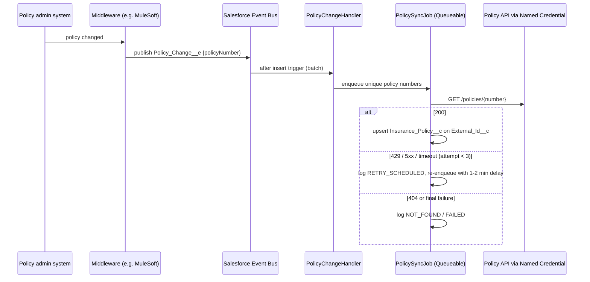

# Policy Sync Integration (Apex callouts, Platform Events, retries)

[](https://github.com/Mounika-Mangiri/sf-policy-sync-integration/actions/workflows/ci.yml)

Keeps Salesforce in step with an external policy-administration system. When a policy changes upstream, middleware publishes a small Platform Event; Salesforce pulls the current policy through a Named Credential and upserts it, retrying transient failures and logging the rest.

> **Representative portfolio project.** Written independently with a synthetic API and synthetic data. It contains no employer or client code, endpoints, credentials or payload formats. In a real build the event would usually be published by an integration layer such as MuleSoft; here a mock API stands in for the source system.

**Skills shown:** Salesforce integration architecture · Platform Events · REST callouts with Named Credentials / External Credentials · Queueable Apex with retry and backoff · idempotent upserts on external Ids · governor-limit-safe batching · integration logging · HttpCalloutMock testing · OpenAPI · Node.js mock API · Docker

## Business problem

Service agents work in Salesforce, but premiums, status and paid-to dates live in the policy-administration system. Stale data causes wrong answers on calls. The integration has to:

- update Salesforce within minutes of an upstream change,
- survive outages and throttling without losing updates,
- never create duplicates when the same change arrives twice,
- keep secrets out of code and leave an audit trail for support.

## What this demonstrates

| Pattern | Where |
| --- | --- |
| Event notification + pull (small event, fetch current state) | `Policy_Change__e`, `PolicyChangeHandler`, `PolicySyncJob` |
| Named Credential callouts, no secrets in code | `PolicyAdminClient` (`callout:PolicyAdminAPI`) |
| Retry classification: 429/5xx/timeouts retried, 4xx and bad JSON not | `PolicyAdminClient.Result.retryable` |
| Backoff with delayed Queueables (`System.enqueueJob(job, minutes)`) | `PolicySyncJob.enqueue` |
| Governor-limit-safe batching (50 callouts per job, remainder chained) | `PolicySyncJob.CALLOUTS_PER_JOB` |
| Idempotent upsert on an external Id | `Database.upsert(..., Insurance_Policy__c.External_Id__c, false)` |
| Partial-success DML with per-row error logging | `PolicySyncJob.upsertPolicies` |
| Buffered integration log, one DML per job | `IntegrationLogger`, `Integration_Log__c` |
| HttpCalloutMock routing many scenarios from one mock | `PolicyApiMock` |
| Contract-tested mock API with OpenAPI spec and Dockerfile | `mock-server/` |

## Architecture



## Run it

### Static checks and mock API (no org needed)

```bash
npm install
npm test                 # mock API contract tests (node:test, 6 tests)
npm run prettier:check   # formatting; the Apex plugin parses every class and trigger
npm run mock             # starts the mock API on http://localhost:3000
curl -H "x-api-key: local-dev-only" http://localhost:3000/policies/DEMO-OK-1
```

Docker: `docker build -t policy-mock mock-server && docker run -p 3000:3000 policy-mock`.

### Salesforce org

```bash
sf org create scratch --definition-file config/project-scratch-def.json --alias policy-sync --set-default
sf project deploy start
sf apex run test --code-coverage --result-format human --wait 20
```

To call a live endpoint (for example the mock server exposed through a tunnel), create in Setup:

1. **External Credential** `PolicyAdminAuth`, authentication protocol *Custom*, with a principal holding an `ApiKey` parameter, and a custom header `x-api-key` = `{!$Credential.PolicyAdminAuth.ApiKey}`.
2. **Named Credential** `PolicyAdminAPI` pointing at the base URL and using that external credential.
3. Give the integration user the `Policy_Sync_Integration` permission set and access to the external credential principal.
4. Run the event trigger as that user with a `PlatformEventSubscriberConfig`, so callouts do not run as the Automated Process user.

Then publish a test event from Anonymous Apex:

```apex
EventBus.publish(new Policy_Change__e(Policy_Number__c = 'DEMO-OK-1', Change_Type__c = 'PREMIUM_PAID'));
```

## Tests

| Suite | Count | Covers |
| --- | --- | --- |
| `PolicyAdminClientTest` | 5 | 200 parse, 503 retryable, 404 not retryable, timeout retryable, malformed JSON |
| `PolicySyncJobTest` | 6 | upsert, idempotency, retry with backoff, final failure, 404, chaining past 50 callouts |
| `PolicyChangeTriggerTest` | 2 | event delivery, de-duplication and trimming, blank numbers ignored |
| `mock-server/test` | 6 | response contract, API key, 404, 503, 429 + Retry-After, input pattern |

Apex tests run in a scratch org (CI job runs them when the `SFDX_AUTH_URL` secret is set). Chained jobs are captured in `PolicySyncJob.deferredJobs` during tests so retry timing can be asserted.

## Security notes

- No URLs, keys or tokens in Apex; everything goes through `callout:PolicyAdminAPI`.
- The mock server's key is a local-only placeholder read from `MOCK_API_KEY`.
- Logged response bodies are truncated to 500 characters; in a regulated org, mask or omit PII before logging.
- The integration permission set grants create/read on logs but not edit or delete, so the audit trail cannot be altered by that user.

## Limitations and next steps

- Linear backoff tops out at 2 minutes; a long outage needs a scheduled replay of `RETRY_SCHEDULED`/`FAILED` rows.
- Upstream deletes are not handled.
- No high-volume bulk path; for initial loads use Bulk API 2.0 from the middleware.
- Add replay-ID checkpointing (`EventBus.TriggerContext.setResumeCheckpoint`) if the subscriber does heavier work.

## Credits

Designed and maintained by Mounika M. Code drafted with AI assistance and reviewed by the author. Licensed under MIT.
